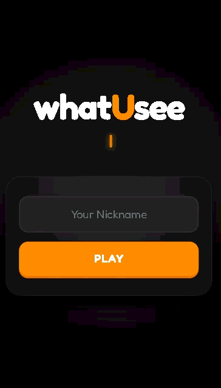
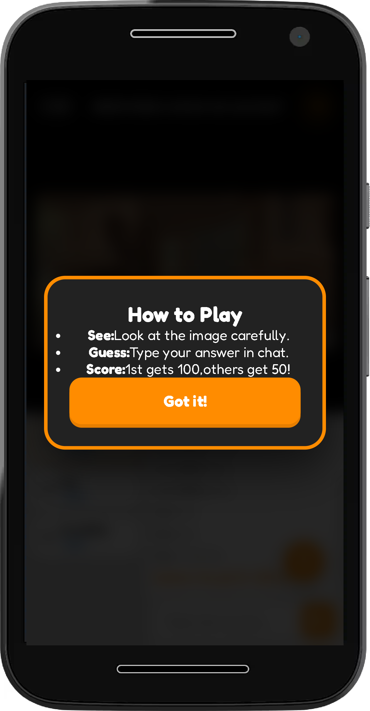
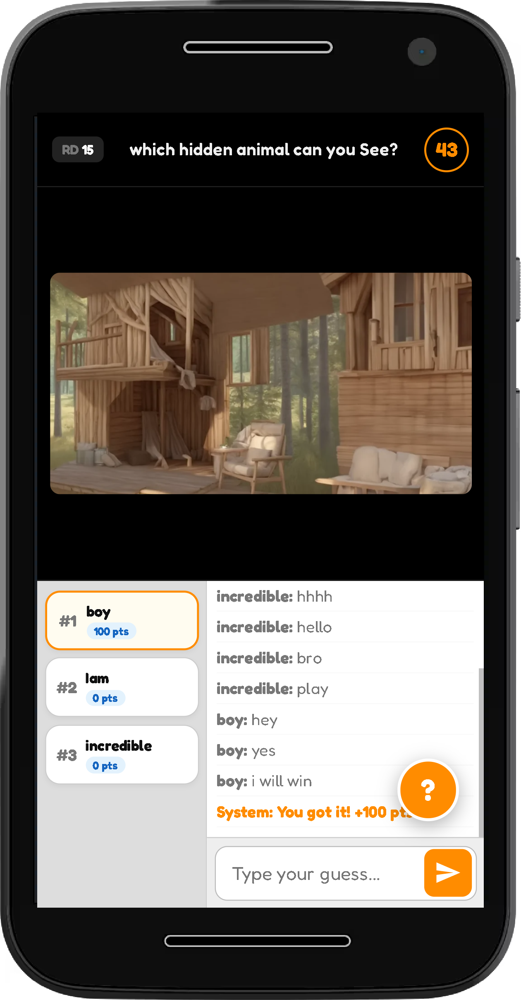

👀 WhatUSee — Real-Time Multiplayer Game

WhatUSee is a fast-paced real-time multiplayer browser(mobile) game where players compete by observing carefully and reacting quickly.  
Challenge your friends in a private room and test who sees it first!

---

🌐 Live Demo

👉 https://whatusee.onrender.com

Note: it may take 15 to 16 min for live demo as its free deployment on render.

---

🎮 Features

- ⚡ Real-time multiplayer gameplay
- 🏠 Create & Join private rooms
- ⏱️ Reaction-based competition
- 📱 Responsive design (Mobile only)
- 🔄 Live synchronization using Socket.io

---

🧠 How To Play

1. Create a room or join using a room code.
2. Wait for other players to join.
3. Start the game.
4. Observe carefully and react fast.
5. The fastest correct player wins!

---

🏠 Room System

- Unique room codes
- Multiplayer support
- Live player updates
- Real-time game start

---

🛠️ Tech Stack

- Frontend: HTML, CSS, JavaScript
- Backend: Node.js + Express
- Real-Time Engine:Socket.io
- Deployment:Render

---

📂 Project Structure

WhatYouSee--multiplayer-game/
│
├── assets/ # Images & GIFs for README
│ ├── demo.gif
│ ├── howtoplay.png
│ └── room.png
│
├── client/ # Frontend
│ ├── css/
│ │ ├── main.css
│ │ └── game.css
│ │
│ ├── js/
│ │ ├── landing.js
│ │ ├── game.js
│ │ ├── chat.js
│ │ ├── socket.js
│ │ ├── timer.js
│ │ └── ui.js
│ │
│ └── index.html
│
├── server/ # Backend
│ ├── data/
│ │ └── images.json
│ │
│ ├── game/
│ │ ├── imagePicker.js
│ │ ├── roundManager.js
│ │ └── scoreManager.js
│ │
│ ├── utils/
│ │
│ └── server.js
│
├── .gitignore # VERY IMPORTANT
├── LICENSE
├── README.md
├── package.json
└── package-lock.json

---

🚀 Run Locally

1. Clone the repository:

git clone https://github.com/A-dot-hub/WhatYouSee--multiplayer-game.git

2. Navigate into the project:

cd WhatYouSee--multiplayer-game

3. Install dependencies:

npm install

4. Start the server:

npm start

5. Open in browser:

http://localhost:3000

---

🤝 Contributing

Contributions are welcome!

If you'd like to:

- Improve gameplay
- Add animations
- Enhance UI
- Fix bugs
- Add leaderboard

Feel free to fork the repo and submit a pull request.

---

📜 License

This project is licensed.

---

⭐ Support

If you like this project, consider giving it a ⭐ on GitHub!
